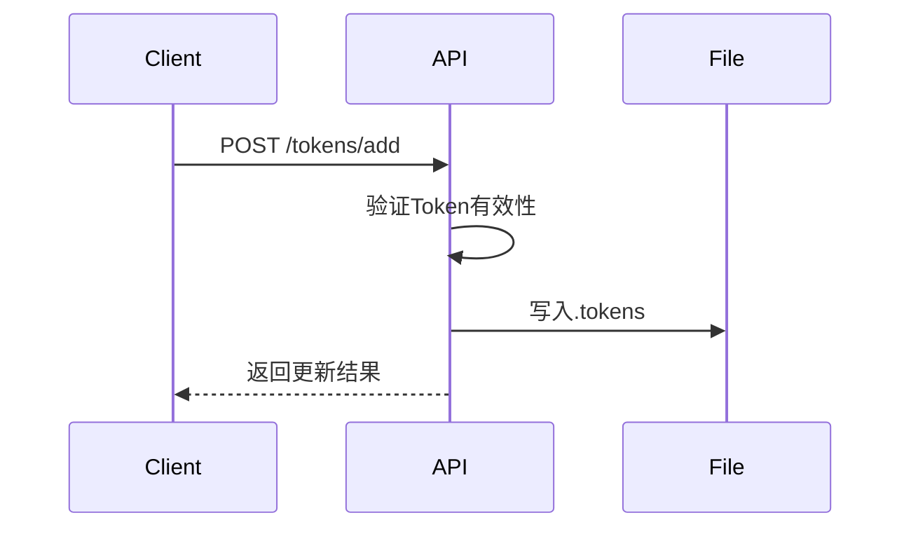

# Cursor API

## 项目说明

### 版本声明
- 当前版本已进入稳定阶段
- 以下问题与程序无关，请勿反馈：
  - 响应缺字漏字
  - 首字延迟现象
  - 响应出现乱码
- 性能优势：
  - 达到原生客户端响应速度
  - 部分场景下表现更优
- 开源协议要求：
  - Fork 项目禁止以原作者名义进行宣传推广
  - 禁止发布任何形式的官方声明


## 快速入门

### 密钥获取
1. 访问 [Cursor 官网](https://www.cursor.com) 完成注册登录
2. 开启浏览器开发者工具 (F12)
3. 在 Application → Cookies 中定位 `WorkosCursorSessionToken`
4. 复制第三个字段值（注意：`%3A%3A` 为 `::` 的 URL 编码形式）

## 配置指南

### 环境变量
| 变量名 | 类型 | 默认值 | 说明 |
|--------|------|--------|-----|
| PORT   | int  | 3000   | 服务端口号 |
| AUTH_TOKEN | string | 无 | 认证令牌（必需） |
| ROUTE_PREFIX | string | 无 | 路由前缀 |
| TOKEN_LIST_FILE | string | .tokens | Token 存储文件 |

完整配置参见 [env-example](/env-example)

### Token 文件规范
`.tokens` 文件格式：
```plaintext
# 注释行将在下次读取时自动删除
token1,checksum1
token2,checksum2
```

文件管理原则：
- 系统自动维护文件内容
- 仅以下情况需要手动编辑：
  - 删除特定 token
  - 绑定已有 checksum 到指定 token

## 模型支持列表
```json
[
  "claude-3.5-sonnet",
  "gpt-4",
  "gpt-4o",
  "cursor-fast",
  "gpt-4o-mini",
  "deepseek-v3"
]
```
*注：模型列表为固定配置，暂不支持自定义扩展*

## API 文档

### 基础对话接口
**Endpoint**
`POST /v1/chat/completions`

**认证方式**
`Bearer Token` 三级认证机制：
1. 环境变量 `AUTH_TOKEN`
2. `.token` 文件轮询
3. 直接 token,checksum 认证（v0.1.3-rc.3+）

**请求示例**
```json
{
  "model": "gpt-4",
  "messages": [
    {
      "role": "user",
      "content": "解释量子计算的基本原理"
    }
  ],
  "stream": false
}
```

**响应示例（非流式）**
```json
{
  "id": "chatcmpl-9Xy...",
  "object": "chat.completion",
  "created": 1628063500,
  "model": "gpt-4",
  "choices": [{
    "index": 0,
    "message": {
      "role": "assistant",
      "content": "量子计算基于量子比特..."
    },
    "finish_reason": "stop"
  }]
}
```

### Token 管理接口
| 端点 | 方法 | 功能 |
|------|------|-----|
| `/tokens` | GET | Token 信息管理界面 |
| `/tokens/set` | POST | 批量更新 Token 列表 |
| `/tokens/add` | POST | 增量添加 Token |
| `/tokens/del` | POST | 删除指定 Token |



## 高级功能

### 动态密钥生成
**Endpoint**
`POST /build-key`

**优势对比**
| 特性 | 传统模式 | 动态密钥 |
|------|---------|---------|
| 密钥长度 | 较长 | 优化缩短 |
| 配置扩展 | 无 | 支持自定义 |
| 安全等级 | 基础 | 增强编码 |
| 验证效率 | 预校验耗时 | 即时验证 |

## 系统监控

### 健康检查
**Endpoint**
`GET /health`

**响应示例**
```json
{
  "status": "success",
  "version": "1.2.0",
  "uptime": 86400,
  "models": ["gpt-4", "claude-3.5"],
  "endpoints": ["/v1/chat", "/tokens"]
}
```

## 生态工具

### 开发辅助工具
- [Token 获取工具](https://github.com/wisdgod/cursor-api/tree/main/tools/get-token)
  支持 Windows/Linux/macOS 系统
- [遥测数据重置工具](https://github.com/wisdgod/cursor-api/tree/main/tools/reset-telemetry)
  清除用户使用数据记录

## 致谢声明
本项目的发展离不开以下开源项目的启发：
- [zhx47/cursor-api](https://github.com/zhx47/cursor-api) - 基础架构参考
- [cursorToApi](https://github.com/luolazyandlazy/cursorToApi) - 认证机制优化方案

--- 

> **项目维护说明**
> 我们欢迎社区贡献，但请注意：
> 1. 功能请求需附带使用场景说明
> 2. Bug 报告请提供复现步骤和环境信息
> 3. 重要变更需通过 CI/CD 测试流程